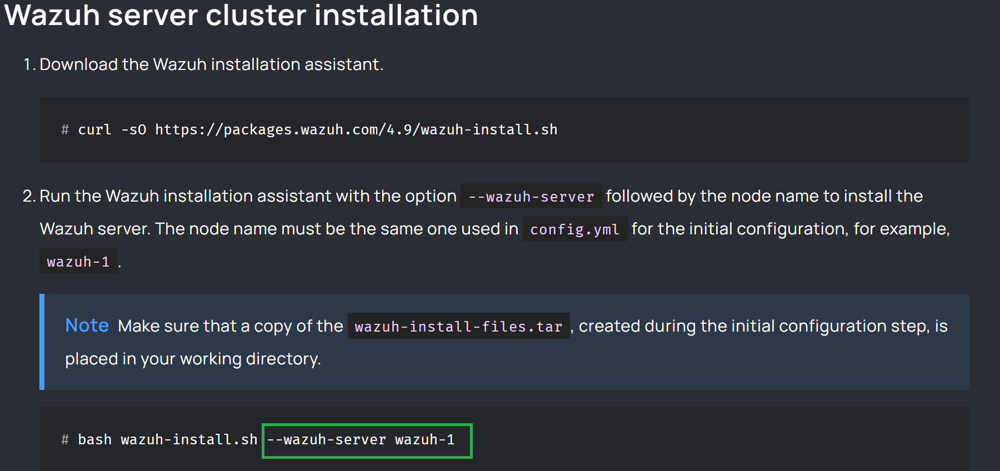
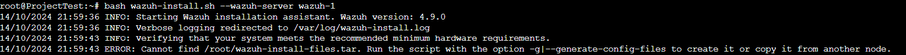
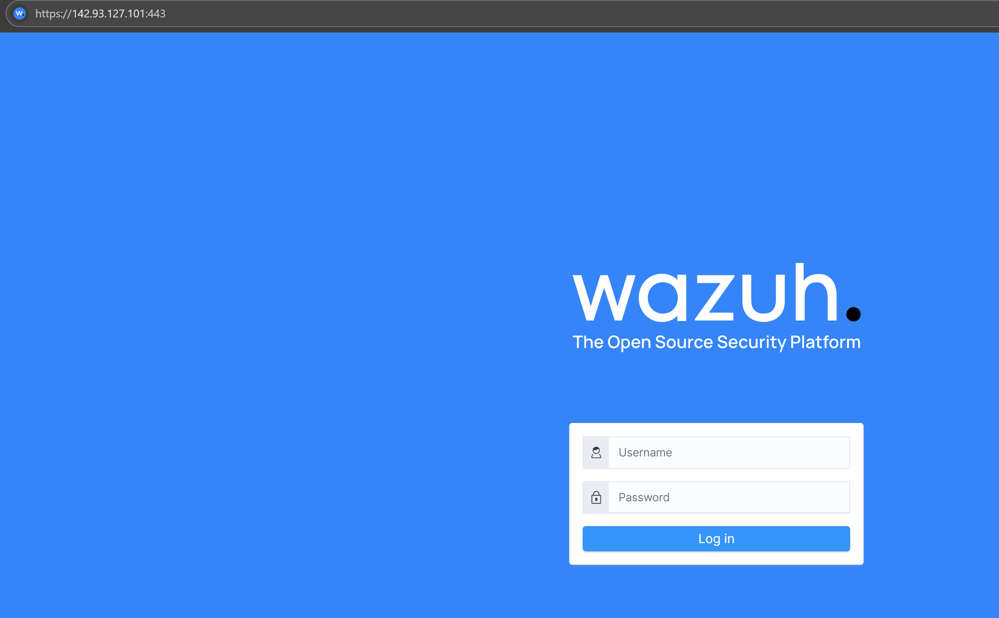
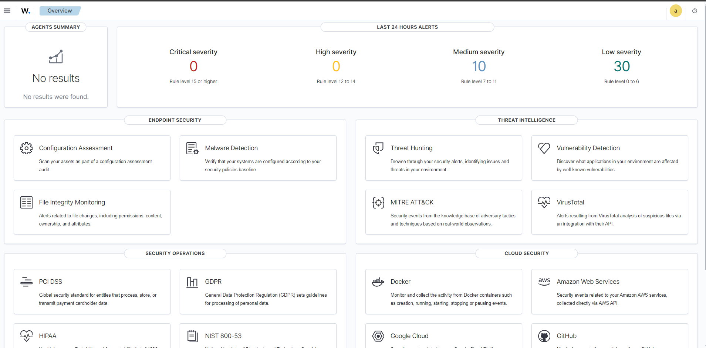

# Cybersecurity 150 Mid-Term

## Name of Project
**How to install Wazuh on Ubuntu 24.06**

## Purpose
**WAZUH on DigitalOcean: A Step-by-Step Guide** 

# Files
1. Simple step by step [Guide](https://medium.com/@akobeajiboluemmanuel/step-by-step-setup-of-wazuh-siem-on-ubuntu-22-04-3-lts-4663104fe69b)
2. Optional guide manuals steps (not recommended for ordinary users) [Challenging](https://computingforgeeks.com/how-to-install-wazuh-server-on-ubuntu/) 

# Tools 
* Digital Ocean server subscription [Digital Ocean](https://www.digitalocean.com/)

* Ubuntu 24.04 installation on server

## Link to Documentation Followed
- [GitHub - fayasmh07/ Wazuh-Server](https://github.com/fayasmh07/Wazuh-Server)

##### Youtube Video 1: [5 Minute Guide](https://www.youtube.com/watch?v=pCKApbHhQiY)

##### Youtube Video 2: Off VM Ubuntu desktop [Challenging](https://www.youtube.com/watch?v=3CfjoCQmpo8)

##### Other Links: 

## Steps I followed
Write the steps you followed here.  This way you can keep track of where you might have messed up if the project does not work.
1. Following the wazuh websites [installation](https://documentation.wazuh.com/current/installation-guide/wazuh-server/installation-assistant.html)  replace --wazuh-server wazuh-1 with -a because I kept getting this outcome  -a is a standard command line option which means, show all information or operate on all arguments
2. Wait for the processing to finish and then you will get a user and a password credentials 
3. On your browser in the URL test box you will fill in https://(server-Ip-address):443 onces wazuh loads you will fill in credentials with user and password information you were given on the console. 
4. You have successfully installed wazuh on  your server  
5. To install a windows agent is a few steps first click on the top left 3 horizontal line menu icon then click server management then endpoint summary. Click deploy agent then just follow the video (begin 8:21- 11:05) [wazuhwindowsagent](https://www.youtube.com/watch?v=JTGMWH2w2p4)
6. You have successfully installed a Windows agent on your Wazuh dashboard

## Problems
Note your problems or errors here.  Google any error you may come across, and what you tried (even if it does not work), and what was the final answer.
1. To install wazuh on digital ocean was best to use the console terminal on the website page instead of personal cpu. Kept running into errors
2. This command bash wazuh-install.sh --wazuh-server wazuh-1 is the default way to install wazuh put kept running into errors through the youtube video I learned that bash wazuh-install.sh -a will work and it did with no issues.
3. Problem 3
4. Problem 4 ... ETC

<!--  
Example
1. Arduino code will not load on ESP32 Cam.
   Answer: Camera drivers were incorrect I needed to install the driver: [https://www.wch-ic.com/downloads/CH341SER_ZIP.html](https://github.com/martin-ger/esp32_nat_router).  I used file, "CH341SER.ZIP" and it worked.
   -->
